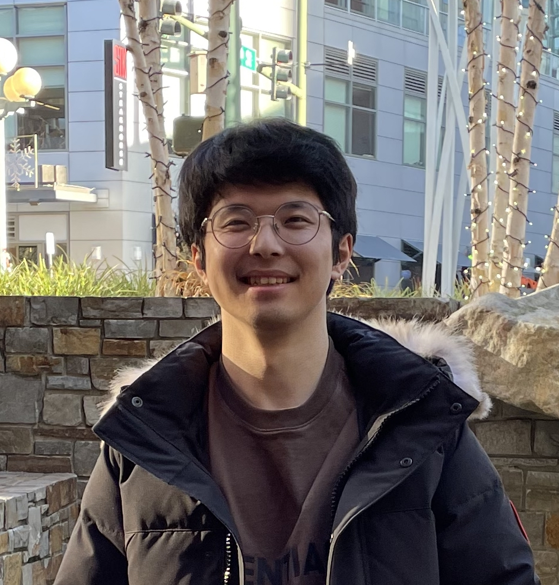

# Zhiyuan Jiao

 

zkjiao73@gmail.com

http://www.linkedin.com/in/zhiyuan-jiao-5a8795172
 
 
## Summary

My passion lies in creating a good geographic information system that could automatically gather, analyze and visualize the data to reveal new perspectives and deeper insights for individuals and organizations.
 
 
## Education

**University of Washington (Seattle, WA)**

Bachelor's Degreee, Geography - Data Science
(2018 - 2022)
 
 
## Experience

**Research Assistant**, University of Washington, Department of Geography (Jan 2021 - Present)

The LGBTQ+ Space project is to manage the digitized Damron guide’s dataset, invite local experts to contribute to the dataset, and enable some fundamental geospatial data visualization, analytics or predictions. It is funded by the NSF HEGS: Examining Shifting Geographies of Historically Underrepresented Groups (Award ID: 1951072).
- Currently working on creating early mockup designs for the whole website.

 

**UX/UI Intern**, University of Washington, Department of Near Eastern Language and Civilization (Sep 2019 – Present)

The project is to digitalize the Svoboda Diaries which comprise over 40 years of personal diaries to understand life, trade, politics during that time.
- Currently working on designing and programming of the Diary Viewer page, uploading new diaries. Implemented different scrolling options, page search function, timeline-diary viewer connection, and resolved mobile version issues.

 

**Dining Student Assistant**, University of Washington (Jun 2019 - Jul 2019)

- Provide customer service, including cashiering, producing, preparing, stocking, catering and food-handling

 

**English Tutor**, Test Bay Education (Aug 2018)

- Answer homework related questions whenever needed
- Assign students' homework and check up with them on a daily basis

 

## Volunteer Service

**Local Volunteer**, 2020 Microsoft Asian Spring Festival (Jan 2020)

- Help setting up the park and stage ahead, manage different booths during the festival.